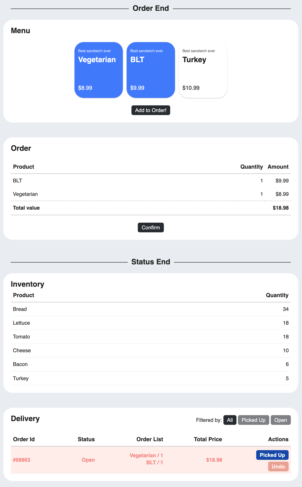

# Dashboard for Commerce

### How to play?

- Click whatever sandwiches you want.
- Add to Order Once you selected the sandwiches.
- Feel free to check product, quantity and total amount.
- Click confirm button to add to the Delivery list.
- Keep track of your order to be picked up.
- Keep your eyes on your inventory, once your ingredients is out of stock, the menu will go off.

### Test

- Tested using React Testing library
- Components are tested with rendering tests, and function tests with mocking functions.

### Semantic Markup

- I used section tags to separate modules.
- Set all the tags for the title to be h1s.
- Separate sections in the module using div tags.
- Used table tags to generate receipt-looking UI(user interface).

### Accessibility

- Contrast sections with extraordinary colours when it comes to emphasis context (Inventory alert, Picked up alert, etc)
- Did not use !important CSS rules for those who have colour disabilities.
- Used Label for checkboxes.
- Implemented aria-label to all the action tags.
